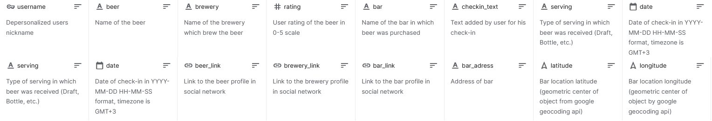

# Untappd-beer-parser
Parser written for gathering data from Untappd, it contain methods to get information from any part of the website. With help of it dataset of 75 thousands chek-ins was gathered, which you can see and use. Hosted on [Kaggle](https://www.kaggle.com/kondrasso/saint-petersburg-craft-beer).

## Motivation
Instrument to conduct analysis of customers preferences in determined area. Can help get statistical data on beer type, form of serving, price, avaliability, consumption geodata, etc. 

## Getting Started
You need Google Chrome installed on your machine, then selenium can atomatically get compatible headless version of it. Everything else contained in requirements.txt.

## Features

Logging in via Faceboo; can be used to collect every data from pre-created list of venues on Untappd, or can work with lists of links to be parsed; can output gathered data to .csv file or store it in pandas.DataFrame; support tqdm progress bar; contains uniform api that can be used directly from console. 

## Example

At first you should create instance of SeleniumWebDriver via **DriverSetup**:

    drv = DriverSetup(headless=False).selenium_driver

Then you need to login, it contains two steps: logging in into Facebook and then loogin in into Untapped via Facebook. That can do **LoginProcess**:

    LoginProcess(drv, 'source', 'log_pass_dummy').log_in()
    
And finally you can start collecting data, for example, if you want to get menu of some venue.
Create list of links of bars, menus of which to be parsed:
    
    bars_to_get_menu = ['https://untappd.com/v/redrum-bar/2498830', 'https://untappd.com/v/socle-craft-bar/8750585']
 
Then you can create instance of **BarsMenu** that contains methods to get data as well as to store it:

    bars_menu = BarsMenu(drv, bars_to_get_menu, to_df=True, to_csv=True)

**to_df** - optional argument to store gathered data as pandas.DataFrame  
**to_csv** - optional argument to export collected data to .csv file  

And finally, you can call built-in method **.parse_bars_menu** and start getting data:

    bars_menu.parse_bars_menu()

That's it! All other classes have the same interface.
